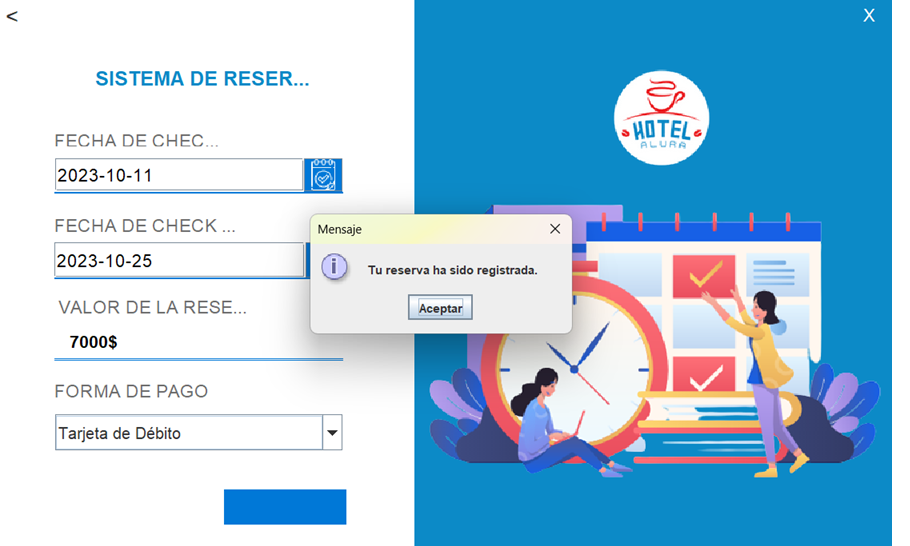
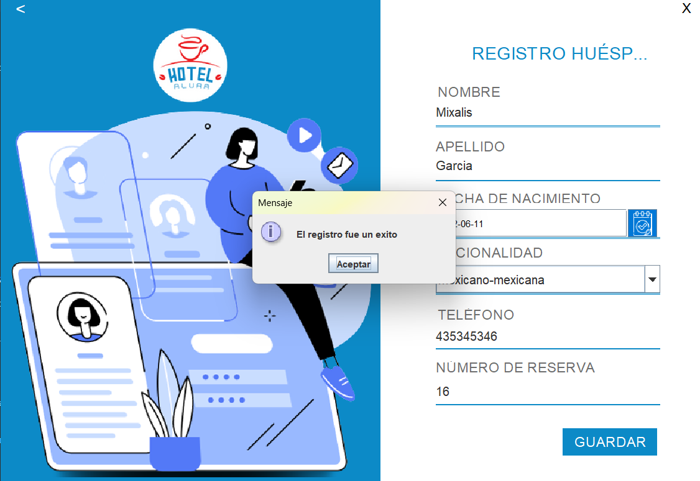
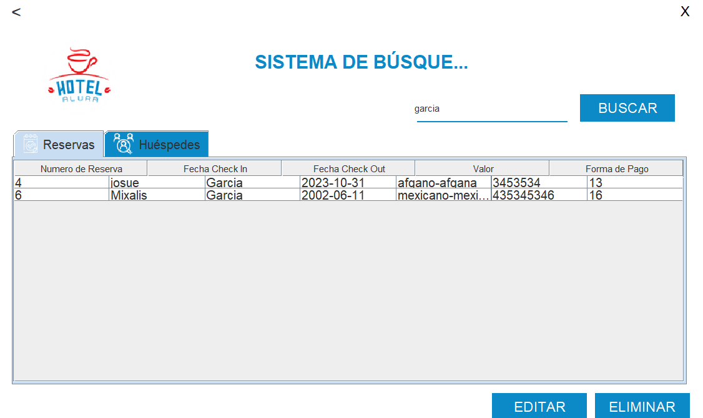
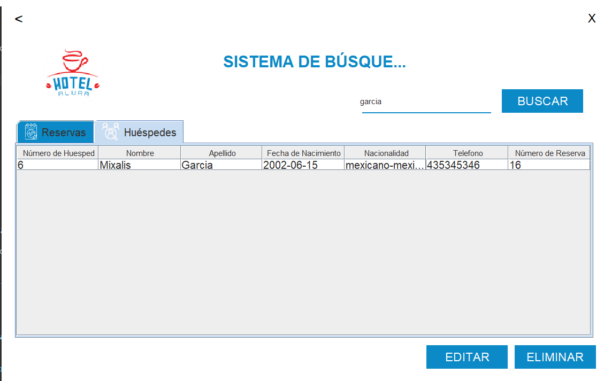

# Java-Hotel
Este es el Challenge de Hotel Alura
Es un sistema de registro de un hotel en la cual se maneja los siguiente:
1. Acceso para usuarios en la base de datoas.
2. Registro de reservacion en el hotel el cual se guarda en la abse de datos.
3. registro de huesped al igual se guarda en la base de datoas.
4. interfaz para busqueda de usuario o id de reserva al igual de eliminacion de estas o edicion.

##Capturas de pantalla
###Acceso a al menu del hotel-Alura
!
###Registro de Huesped
!
###Busqueda de Huesped por apellido
!
###Eliminacio de Huesped y Edicion
!

##Modo de uso
Solo se necesita abrir la aplicacion de forma de jar o desde views en login.java al correrlo podra ver
todo el proyecto para encontrar su funcionalidad.

##Autores:
josue Mixalis Garcia Carbajal